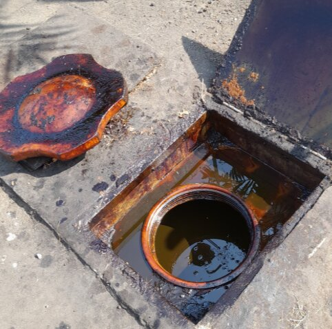
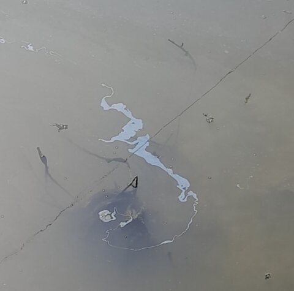
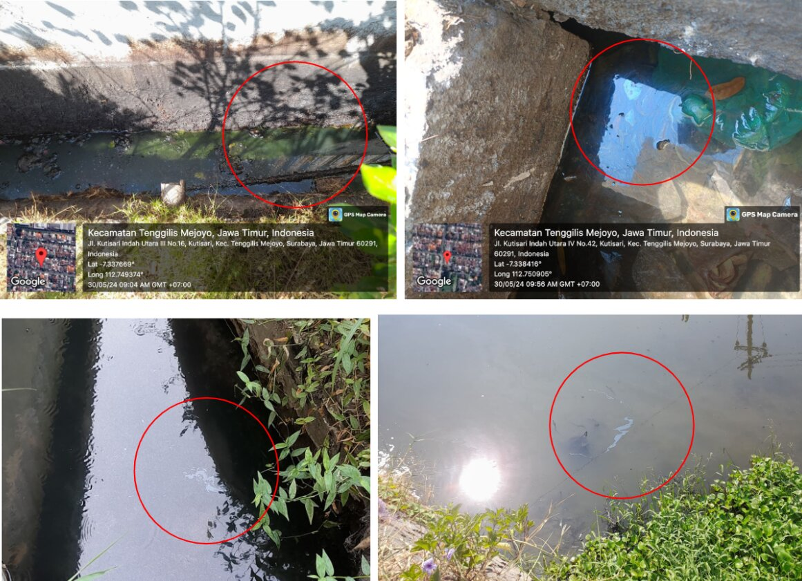
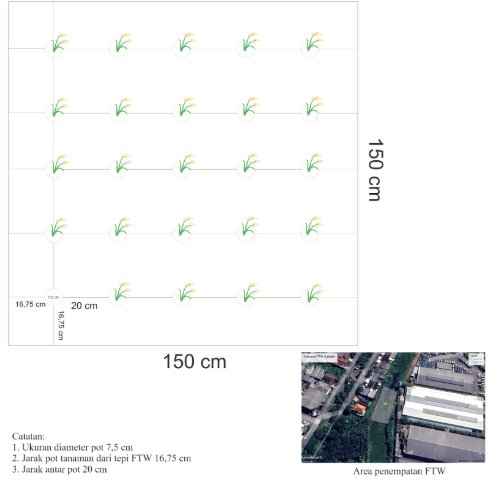
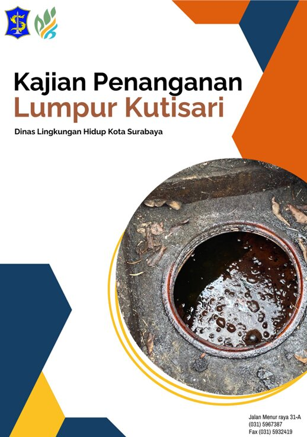

## Overview

Never have I thought that the city I live in contains something beneath its surface, something important yet dangerous. Surabaya, being the second largest city in Indonesia, has been staying close to developments, civilization, and industry, even from the Dutch colonizer era. The Dutch had built this city and its industry, which needed an energy to run it. Hence, the oil exploration in Surabaya began and they are successfully built several oil drilling sites; one of them is in Kuti region or, now called Kutisari. However, the post-revolution development of this city ignored the abandoned oil reserves for many years without proper treatment. This led to the mud and oil eruption in Kutisari, Surabaya, on 23 September 2019, which caused air pollution, water contamination, and soil damage, affecting local residents. To follow up on this issue, the Surabaya City Government, through the Surabaya DLH, has taken measures to address the problem, one of which is to conduct a preliminary study on remediation measures for contaminated water and soil.

## Findings🤓

After the eruption incident in 2019, DLH Surabaya responded quickly by installing oil-water separators to reduce the pollution. However, the oil leakage to the surrounding area is still happening. Hence, DLH Surabaya conducted this preliminary study with the aims to assess the environmental impacts and evaluate response strategies and propose effective remediation methods.

In this study, we selected two primary methods for water and soil remediation, with a particular emphasis on the use of plants as hydrocarbon-chelating agents. For contaminated water, especially in the river located behind the residential area, we proposed the application of phytoremediation to purify and restore water quality. In the case of contaminated soil, we adopted an ex situ soil washing approach, utilizing bio-solvents as substitutes for conventional chemical solvents. This strategy was intended to minimize secondary waste generation and reduce the adverse effects of chemical residues, particularly given that the leakage sites are situated within densely populated residential areas.

## Records🖼️

{fig-align="center"}

{fig-align="center"}

{fig-align="center"}

{fig-align="center"}

{fig-align="center"}
