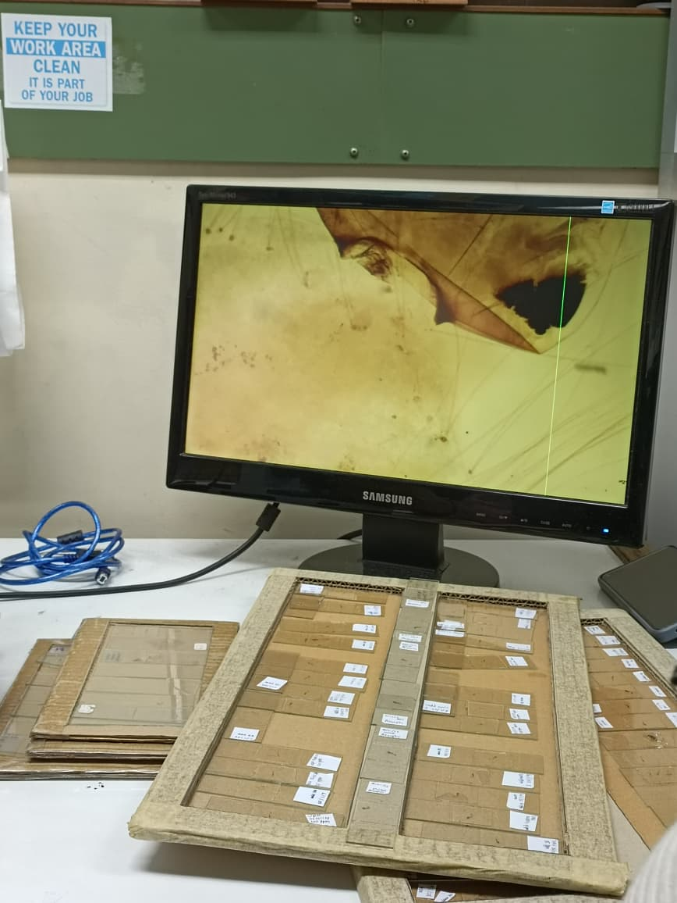
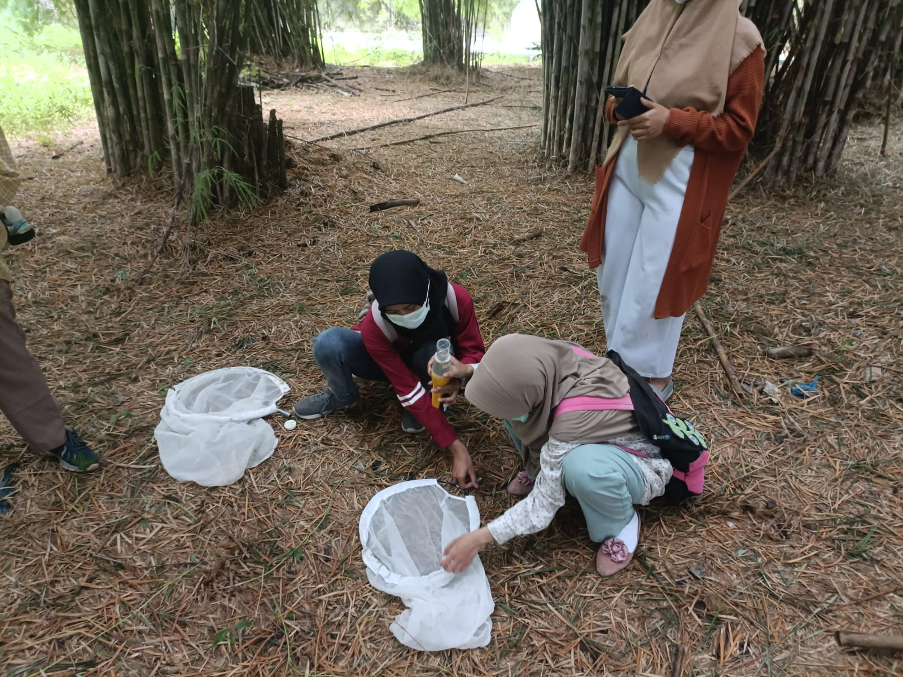

## Overview

The internship began during the semester break in January and lasted for a full month. There, me and four other biology students from Airlangga University conducted various studies and observations on insects, particularly mosquitoes. Guided by two laboratory staff members, we carried out different activities each week, such as identifying mosquito larvae and adult mosquito species, studying mosquito diversity in the East Surabaya area, testing larva predation using betta fish, and testing the effectiveness of essential oils from peppermint, lavender, and citronella plants on *Aedes aegypti* mosquitoes.

## Research Findings🤓

The topic I chose was about the diversity of mosquito species in the East Surabaya area, where mosquito samples were collected at four different locations, namely Keputih Bamboo Forest, Keputih Harmony Park, Keputih residents' homes, and ITD UNAIR. This study was to mapping to mapped the mosquito species in Surabaya and monitoring the mosquito species for disease control. The key findings are as follows:

-   There are several mosquito species identified, such as *Aedes aegypti*, *Aedes albopictus, Culex quinquefasciatus, Culex pseudovishnui*, and *Malaya genurostris*.
-   The highest diversity was Keputih Harmony Park with H' = 0.61139, and the lowest was ITD with H' = 0. The overall diversity was low, with the dominance of a single species at some sites.
-   Breeding sites vary across natural and artificial water containers.

The findings of this study then compiled to data from other areas and presented in International Conference on SDGs for Sustainable Future (ICSSF 2024).

## Records🖼️

{fig-align="center"}

{fig-align="center"}

{fig-align="center"}

{fig-align="center"}
