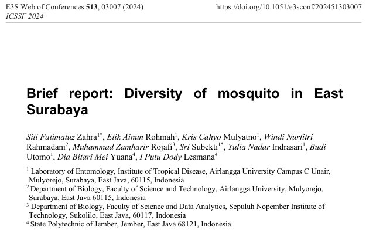

## Abstract

Mosquitoes are insects that are detrimental to human health because they act as disease vectors, such as dengue fever. Surabaya was known for its high risk of dengue fever. This study aims to describe the diversity of mosquitoes and breeding site distribution in Eastern Surabaya. The study was conducted in 2021 during the end of the wet season in different habitat types in the eastern Surabaya (residential, city park, bamboo forest, and mangrove forest). Eggs, larval, and adult-stage mosquitoes were collected and stored in the Entomology Laboratory for morphological identification. Adult mosquito was collected by using a sweep net and light trap method, while the larva and egg were collected incidentally from breeding sites. The diversity of mosquitoes in the Eastern Surabaya was determined by using the Shannon-Wiener diversity index (H’), dominance, species richness (R), and breeding site distribution. Eleven species were obtained in this study, namely *Aedes aegypti, Aedes albopictus, Aedes annandalei, Anopheles subpictus, Anopheles vagus, Anopheles barbirostris, Culex bitaeniorhynchus, Culex pseudovishnui, Culex quinquefasciatus, Mansonia uniformis,* and *Malaya genurostris*. The H’ index of 1.63 indicates the mosquito community was at a moderate level. The R-value of 1.56 indicates a low level of mosquito species richness. The most abundant species was *Cx. quinquefasciatus* (37.2%). Most of the breeding sites with mosquito larval infested were found in open areas (79.3%). These numbers mean the total of individuals of each species tends to be low and its dominance shows no effect on other species. The data on mosquito species and their distribution in Surabaya could be used as base information for vector control strategies.

## Link 🔗

The paper can be read with the link below:

[The paper is here 🙌🏼](https://www.e3s-conferences.org/articles/e3sconf/abs/2024/43/e3sconf_icssf2024_03007/e3sconf_icssf2024_03007.html)

## Records🖼️

{fig-align="center"}
