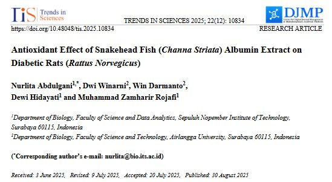

## Abstract

Snakehead fish extract (SHE) has beentraditionally used for diabetes therapy due to its antioxidant properties, yet its effects in high-fat diet (HFD) and streptozotocin (STZ)-induced diabetic models remain underexplored. This study evaluated the antioxidant and antidiabetic effects of SHE in diabetic rats by measuring malondialdehyde (MDA), glutathione (GSH), GLUT-4 density and HOMA-IR index. Thirty Wistar rats were divided into five groups: Healthy control (C−), diabetic control (C+) and diabetic rats treated with low (LD: 2 mL/day), medium (MD: 3 mL/day) and high (HD: 4 mL/day) doses of SHE for 28 days. SHE was administered orally following HFD-STZ induction. SHE significantly reduced MDA levels in diabetic rats to levels comparable with healthy controls (p-value\< 0.05), though GSH levels showed no consistent improvement. GLUT-4 density in striated muscle membranes increased significantly in all SHE-treated groups (p-value\< 0.05) and fasting blood glucose levels decreased, though not to normoglycemic levels. The HOMA-IR index was also significantly reduced in MD and HD groups, indicating improved insulin sensitivity. Antioxidant activity was confirmed via the ABTS assay, with 50% radical inhibition at 125 μg/mL. In conclusion, SHE demonstrates dose-dependent antioxidant and antidiabetic effects by lowering MDA levels, enhancing GLUT-4 density, reducing blood glucose and improving insulin resistance. However, this study has limitations, including the use of blood-based biomarkers for MDA and GSH, which may not fully reflect tissue-specific oxidative stress. Additionally, the total protein analysis did not identify the specific albumin content or amino acid composition of SHE, which should be addressed in future studies to better understand its bioactive components and mechanisms.

## Link 🔗

The paper can be read with the link below:

[The paper is here 🙌🏼](https://tis.wu.ac.th/index.php/tis/article/view/10834)

## Records🖼️

{fig-align="center"}
