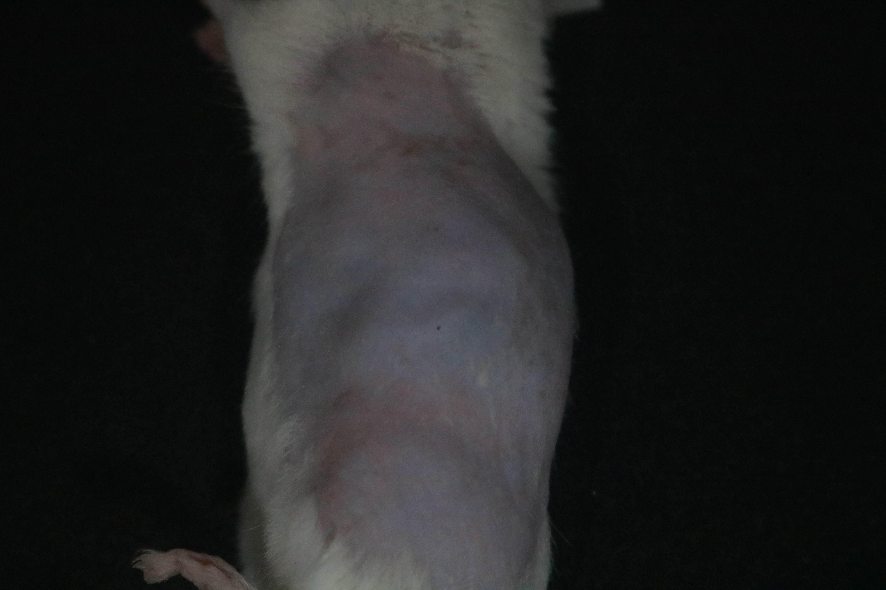
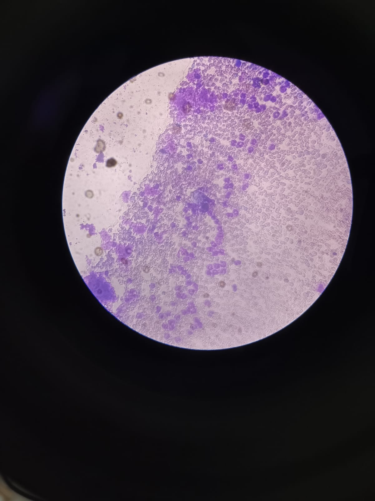
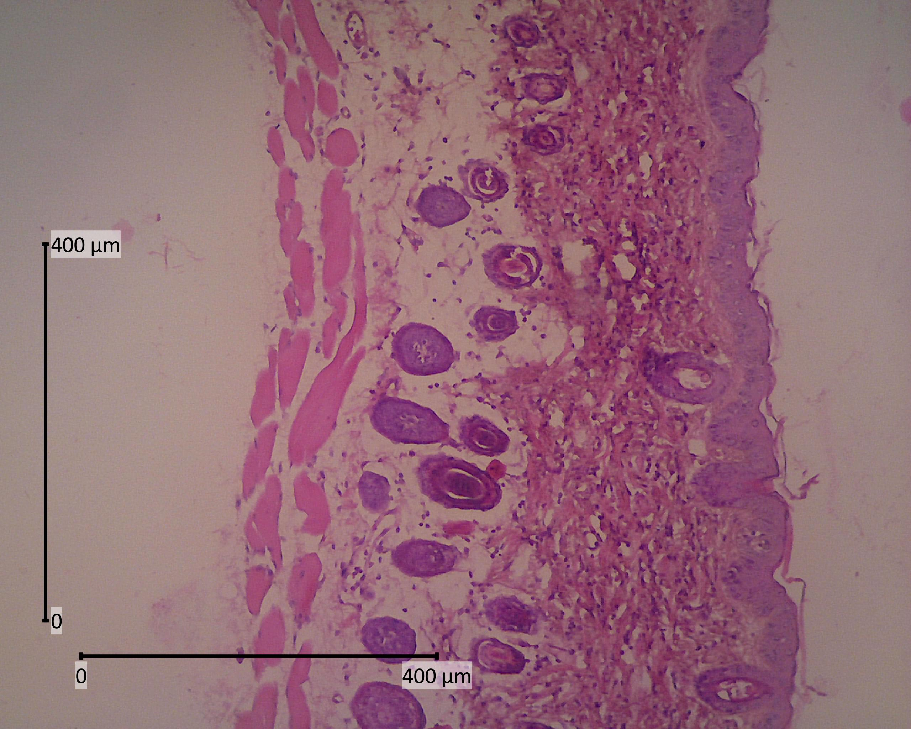

## Overview

The unripe fruit of pisang kayu (*Musa paradisiaca* L. var. Kayu) has traditionally been utilized in East Java, Indonesia, as a natural remedy for diarrhea. Previous studies have demonstrated that its ethanol extract possesses notable antidiarrheal and antibacterial properties, attributed to the presence of phytochemicals such as tannins, flavonoids, saponins, and alkaloids. Nevertheless, prior to its development as a standardized herbal medicine, comprehensive safety evaluations are essential. Accordingly, our research group conducted a series of assessments—including allergy testing, hematological analysis, and teratogenic evaluation—to investigate the safety profile of the pisang kayu ethanol extract.

## Research Findings🤓

In this research team, I was entrusted to perform the anti allergy test which refers to the Organization fro Environmental Control Development (OECD) Guidelines for the Testing of Chemicals no. 406. The test used two methods–acute and subchronic allergy test– using *Mus musculus* as the experimental animals to investigate the effect of pisang kayu ethanol extract. The key findings are as follows:

-   No visible allergic reactions (rash, edema, angioedema) in any treatment group.
-   Skin histology showed normal epidermis (\<25 µm) and dermis (\<280 µm) thickness, with no hyperplasia.
-   Leukocyte counts remained within normal ranges; eosinophils and basophils did not increase significantly.
-   Differences between acute and subchronic tests were minor and related to wound-induced inflammation, not allergy.

## Records🖼️

{fig-align="center"}

{fig-align="center"}

{fig-align="center"}
